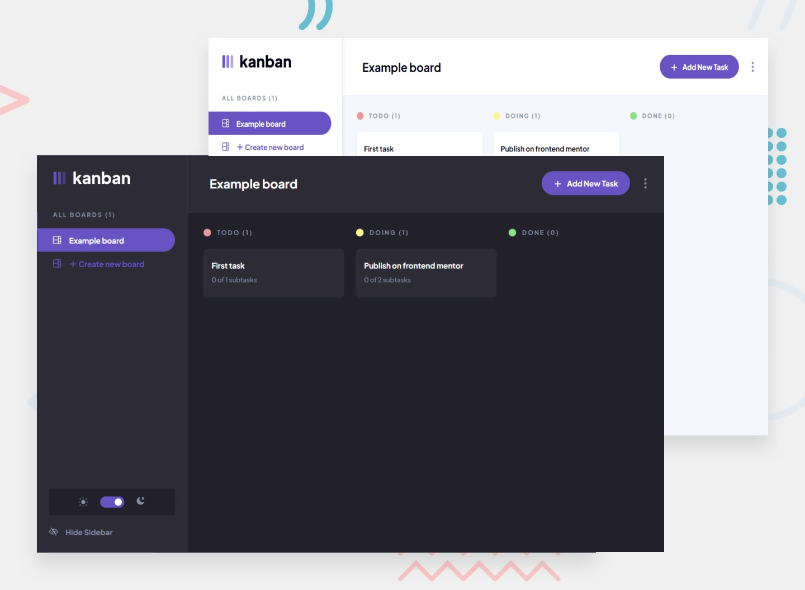

## Kanban task management web app

- [Live preview](https://task-manager-ten-pi.vercel.app)

## Table of contents

- [Frontend Mentor - Kanban task management web app solution](#frontend-mentor---kanban-task-management-web-app-solution)
- [Table of contents](#table-of-contents)
  - [App](#app)
  - [How to run](#how-to-run)
  - [Built with](#built-with)
  - [Author](#author)

### App

Users should be able to:

- Create, read, update, and delete boards and tasks
- Receive form validations when trying to create/edit boards and tasks
- Mark subtasks as complete and move tasks between columns (also via drag and drop)
- Hide/show the board sidebar
- Toggle the theme between light/dark modes
- Mobile responsive

### How to run

- Download [bun](https://bun.sh/)
- Clone the repo
- Run `bun i` to install dependencies
- Run `bun dev` to start the development server
- Open [http://localhost:3000](http://localhost:3000) with your browser to see the result.

### Built with

- [Next.js](https://nextjs.org/)
- [Typescript](https://www.typescriptlang.org/)
- [Tailwind] (https://tailwindcss.com/)
- [Hook Form] (https://react-hook-form.com/)
- [Zod] (https://zod.dev/)
- [Zustand] (https://zustand-demo.pmnd.rs/)

### Author

- LinkedIn - [Donato Di Zenzo](https://www.linkedin.com/in/donato-di-zenzo/)
- Frontend Mentor - [@dodiz](https://www.frontendmentor.io/profile/dodiz)
